```python
import numpy as np
import pandas as pd

import matplotlib.pylab as plt
import seaborn as sns
```


```python
jx_2013 = pd.read_csv(r'./2013经济.csv', engine='python', encoding="UTF-8")
jx_2015 = pd.read_csv(r'./2015经济.csv', engine='python', encoding="UTF-8")
jx_2016 = pd.read_csv(r'./2016经济.csv', engine='python', encoding="UTF-8")
```


```python
import matplotlib.pyplot as plt

jx16 = jx_2016.set_index('地区')

# 设置绘图的主题风格（不妨使用R中的ggplot分隔）
plt.style.use('ggplot')

# 构造数据
edu = jx16.loc['生产总值']
labels = jx16.loc['生产总值'].index

explode = [0.1,0,0,0,0,0,0,0,0,0,0]  # 用于突出显示大专学历人群
colors=['#FFB6C1','#C71585','#8B008B','#4B0082','#6A5ACD','#0000CD','#B0C4DE','#708090','#2F4F4F','#00FF7F','#808000'] # 自定义颜色

# 中文乱码和坐标轴负号的处理
plt.rcParams['font.sans-serif'] = ['Microsoft YaHei']
plt.rcParams['axes.unicode_minus'] = False

# 将横、纵坐标轴标准化处理，保证饼图是一个正圆，否则为椭圆
plt.axes(aspect='equal')

# 控制x轴和y轴的范围
plt.xlim(0,4)
plt.ylim(0,4)

# 绘制饼图
plt.pie(x = edu, # 绘图数据
        labels=labels, # 添加教育水平标签
        explode=explode,
        colors=colors, # 设置饼图的自定义填充色
        autopct='%.1f%%', # 设置百分比的格式，这里保留一位小数
        pctdistance=0.8,  # 设置百分比标签与圆心的距离
        labeldistance = 1.15, # 设置教育水平标签与圆心的距离
        startangle = 180, # 设置饼图的初始角度
        radius = 1.5, # 设置饼图的半径
        counterclock = False, # 是否逆时针，这里设置为顺时针方向
        wedgeprops = {'linewidth': 1.5, 'edgecolor':'green'},# 设置饼图内外边界的属性值
        textprops = {'fontsize':12, 'color':'k'}, # 设置文本标签的属性值
        center = (1.8,1.8), # 设置饼图的原点
        frame = 1 )# 是否显示饼图的图框，这里设置显示

# 删除x轴和y轴的刻度
plt.xticks(())
plt.yticks(())
# 添加图标题
plt.title('江西省GDP占比')

# 显示图形
plt.show()
```


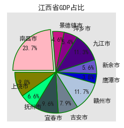


```python
jx13 = jx_2013.set_index('地区')
jx15 = jx_2015.set_index('地区')
jx16 = jx_2016.set_index('地区')

y13 = jx13.loc['生产总值']
y15 = jx15.loc['生产总值']
y16 = jx16.loc['生产总值']

labels = y13.index
bar_width = 1

plt.rcParams['font.sans-serif'] = ['SimHei']
plt.rcParams['axes.unicode_minus'] = False

sns.set(font='SimHei')


plt.bar(np.arange(0,55,5), y13, label = '2013', color = 'steelblue', alpha = 0.8, width = bar_width)
plt.bar(np.arange(0,55,5)+bar_width, y15, label = '2015', color = 'indianred', alpha = 0.8, width = bar_width)
plt.bar(np.arange(0,55,5)+bar_width*2, y16, label = '2016', color = 'g', alpha = 0.8, width = bar_width)

plt.xlabel('地区')
plt.ylabel('生产总值')

plt.title('各地区三年生产总值')

plt.xticks(np.arange(0,55,5)+bar_width,labels)
plt.ylim([0, 5000])

plt.rcParams['figure.figsize'] = (8.0, 4.0)
    
# 显示图例
plt.legend()
# 显示图形
plt.show()
```


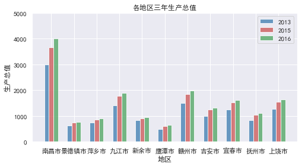


```python
jx13 = jx_2013.set_index('地区')
jx15 = jx_2015.set_index('地区')
jx16 = jx_2016.set_index('地区')

y13 = jx13.loc['人均gdp']
y15 = jx15.loc['人均gdp']
y16 = jx16.loc['人均gdp']

labels = y13.index
bar_width = 1

plt.rcParams['font.sans-serif'] = ['SimHei']
plt.rcParams['axes.unicode_minus'] = False

sns.set(font='SimHei')


plt.bar(np.arange(0,44,4), y13, label = '2013', color = 'steelblue', alpha = 0.8, width = bar_width)
plt.bar(np.arange(0,44,4)+bar_width, y15, label = '2015', color = 'indianred', alpha = 0.8, width = bar_width)
plt.bar(np.arange(0,44,4)+bar_width*2, y16, label = '2016', color = 'g', alpha = 0.8, width = bar_width)

plt.xlabel('地区')
plt.ylabel('人均gdp')

plt.title('各地区三年人均GDP')

plt.xticks(np.arange(0,44,4)+bar_width,labels)

plt.ylim([0, 100000])
    
# 显示图例
plt.legend()

plt.rcParams['figure.figsize'] = (8.0, 4.0)
# 显示图形
plt.show()
```


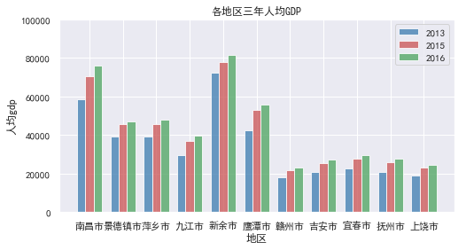


```python
GDP = [0,0,0]
GDP[0] = jx_2013.iloc[0,1:].sum()
GDP[1] = jx_2015.iloc[0,1:].sum()
GDP[2] = jx_2016.iloc[0,1:].sum()

# 中文乱码的处理
plt.rcParams['font.sans-serif'] =['Microsoft YaHei']
plt.rcParams['axes.unicode_minus'] = False

# 绘图
plt.bar(range(3), GDP, align = 'center',color='steelblue', alpha = 0.8)
# 添加轴标签
plt.ylabel('GDP')
# 添加标题
plt.title('江西GDP')
# 添加刻度标签
plt.xticks(range(3),['2013','2015','2016'])
# 设置Y轴的刻度范围
plt.ylim([10000,20000])

# 为每个条形图添加数值标签
for x,y in enumerate(GDP):
    plt.text(x,y+100,'%s' %round(y,1),ha='center')
```


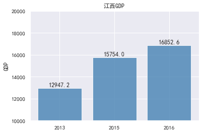


```python
# 总体的生产总值相关度  皮尔逊积矩相关系数
jx_corrcoef16 = np.corrcoef(jx_2016.iloc[0:9,1:])

corrcoefIndex = jx_2013['地区'][0:9]

plt.rcParams['font.sans-serif'] = ['SimHei']  # 中文字体设置-黑体
plt.rcParams['axes.unicode_minus'] = False  # 解决保存图像是负号'-'显示为方块的问题
sns.set(font='SimHei')  # 解决Seaborn中文显示问题
plt.title("江西省")

hm = sns.heatmap(jx_corrcoef16,cbar = True,annot = True,square = True ,fmt = '.2f',annot_kws = {'size': 10},yticklabels = corrcoefIndex,xticklabels = corrcoefIndex)
plt.show()
```


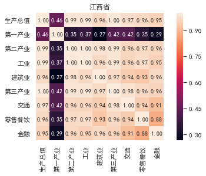


```python
# 各市单独数据
corrcoefIndex = jx_2013['地区'][0:9]
for i in jx_2013.iloc[0].index[1:]:
# 每个市
    df = {}
    for j, k in {'jx_2013':jx_2013,'jx_2015':jx_2015,'jx_2016':jx_2016}.items():
    #每年
        df[j] = k[i][0:9]
        
#     print(df)
    df = pd.DataFrame(df)
    
    city_corrcoef = np.corrcoef(df)

    plt.rcParams['font.sans-serif'] = ['SimHei']  # 中文字体设置-黑体
    plt.rcParams['axes.unicode_minus'] = False  # 解决保存图像是负号'-'显示为方块的问题
    sns.set(font='SimHei')  # 解决Seaborn中文显示问题
    plt.title(i)

    hm = sns.heatmap(city_corrcoef,cbar = True,annot = True,square = True ,fmt = '.2f',annot_kws = {'size': 10},yticklabels = corrcoefIndex,xticklabels = corrcoefIndex)
    plt.show()
         
```


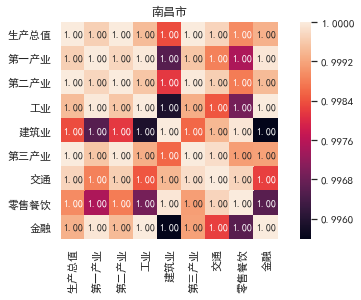


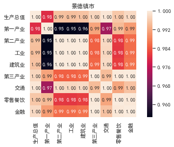


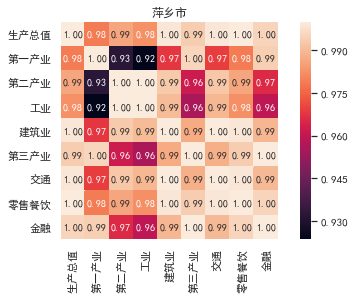


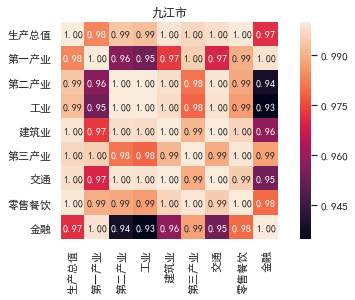


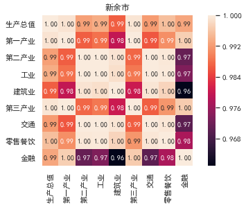


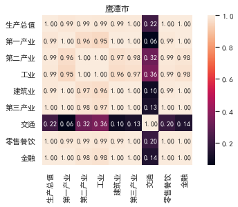


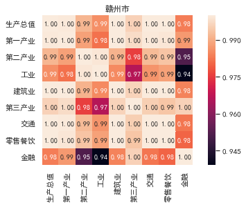


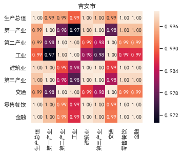


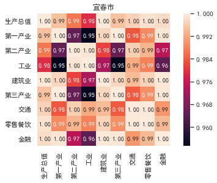


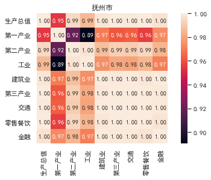


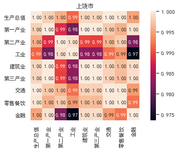


```python
jx_2013.iloc[0].index
```


    Index(['地区', '南昌市', '景德镇市', '萍乡市', '九江市', '新余市', '鹰潭市', '赣州市', '吉安市', '宜春市',
           '抚州市', '上饶市'],
          dtype='object')


```python
# 政府支出占比,   消费条形图
jx13 = jx_2013.set_index('地区')
jx15 = jx_2015.set_index('地区')
jx16 = jx_2016.set_index('地区')

y13 = jx13.loc['最终消费']
y15 = jx15.loc['最终消费']
y16 = jx16.loc['最终消费']

labels = y13.index
bar_width = 1

plt.rcParams['font.sans-serif'] = ['SimHei']
plt.rcParams['axes.unicode_minus'] = False

sns.set(font='SimHei')


plt.bar(np.arange(0,44,4), y13, label = '2013', color = 'steelblue', alpha = 0.8, width = bar_width)
plt.bar(np.arange(0,44,4)+bar_width, y15, label = '2015', color = 'indianred', alpha = 0.8, width = bar_width)
plt.bar(np.arange(0,44,4)+bar_width*2, y16, label = '2016', color = 'g', alpha = 0.8, width = bar_width)

plt.xlabel('地区')
plt.ylabel('最终消费')

plt.title('各地区三年消费水平')

plt.xticks(np.arange(0,44,4)+bar_width,labels)

plt.ylim([0, 2500])
    
# 显示图例
plt.legend()

plt.rcParams['figure.figsize'] = (8.0, 4.0)
# 显示图形
plt.show()
```


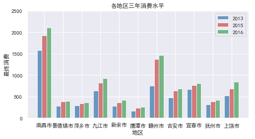


```python
zfzc_13 = jx_2013.iloc[18][1:]/jx_2013.iloc[14][1:]
zfzc_15 = jx_2015.iloc[18][1:]/jx_2015.iloc[14][1:]
zfzc_16 = jx_2016.iloc[18][1:]/jx_2016.iloc[14][1:]

labels = y13.index
bar_width = 1

plt.rcParams['font.sans-serif'] = ['SimHei']
plt.rcParams['axes.unicode_minus'] = False

sns.set(font='SimHei')


plt.bar(np.arange(0,44,4), zfzc_13, label = '2013', color = 'steelblue', alpha = 0.8, width = bar_width)
plt.bar(np.arange(0,44,4)+bar_width, zfzc_15, label = '2015', color = 'indianred', alpha = 0.8, width = bar_width)
plt.bar(np.arange(0,44,4)+bar_width*2, zfzc_16, label = '2016', color = 'g', alpha = 0.8, width = bar_width)

plt.xlabel('地区')
plt.ylabel('政府支出占比')

plt.title('各地区三年政府支出占总支出')

plt.xticks(np.arange(0,44,4)+bar_width,labels)

plt.ylim([0, 0.5])
    
# 显示图例
plt.legend()

plt.rcParams['figure.figsize'] = (8.0, 4.0)
# 显示图形
plt.show()
```


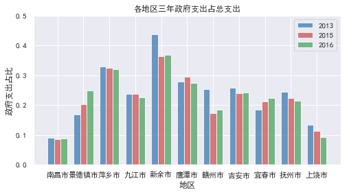


```python
# 政府支出占比,   消费条形图
jx13 = jx_2013.set_index('地区')
jx15 = jx_2015.set_index('地区')
jx16 = jx_2016.set_index('地区')

y13 = jx13.loc['自然保护区占辖区面积比重']
y15 = jx15.loc['自然保护区占辖区面积比重']
y16 = jx16.loc['自然保护区占辖区面积比重']

labels = y13.index
bar_width = 1

plt.rcParams['font.sans-serif'] = ['SimHei']
plt.rcParams['axes.unicode_minus'] = False

sns.set(font='SimHei')


plt.bar(np.arange(0,44,4), y13, label = '2013', color = 'steelblue', alpha = 0.8, width = bar_width)
plt.bar(np.arange(0,44,4)+bar_width, y15, label = '2015', color = 'indianred', alpha = 0.8, width = bar_width)
plt.bar(np.arange(0,44,4)+bar_width*2, y16, label = '2016', color = 'g', alpha = 0.8, width = bar_width)

plt.xlabel('地区')
plt.ylabel('自然保护区占比')

plt.title('自然保护区占辖区面积占比')

plt.xticks(np.arange(0,44,4)+bar_width,labels)

plt.ylim([0, 20])
    
# 显示图例
plt.legend()

plt.rcParams['figure.figsize'] = (8.0, 4.0)
# 显示图形
plt.show()
```


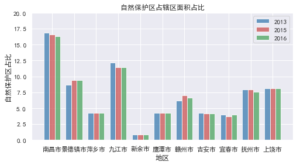


```python
jx_2016
```


<div>
<style scoped>
    .dataframe tbody tr th:only-of-type {
        vertical-align: middle;
    }

    .dataframe tbody tr th {
        vertical-align: top;
    }

    .dataframe thead th {
        text-align: right;
    }
</style>
<table border="1" class="dataframe">
  <thead>
    <tr style="text-align: right;">
      <th></th>
      <th>地区</th>
      <th>南昌市</th>
      <th>景德镇市</th>
      <th>萍乡市</th>
      <th>九江市</th>
      <th>新余市</th>
      <th>鹰潭市</th>
      <th>赣州市</th>
      <th>吉安市</th>
      <th>宜春市</th>
      <th>抚州市</th>
      <th>上饶市</th>
    </tr>
  </thead>
  <tbody>
    <tr>
      <th>0</th>
      <td>生产总值</td>
      <td>4000.01</td>
      <td>772.06</td>
      <td>912.39</td>
      <td>1902.68</td>
      <td>946.80</td>
      <td>639.26</td>
      <td>1973.87</td>
      <td>1328.52</td>
      <td>1621.02</td>
      <td>1105.14</td>
      <td>1650.81</td>
    </tr>
    <tr>
      <th>1</th>
      <td>第一产业</td>
      <td>171.26</td>
      <td>57.22</td>
      <td>62.83</td>
      <td>140.75</td>
      <td>55.95</td>
      <td>49.40</td>
      <td>295.56</td>
      <td>217.40</td>
      <td>236.04</td>
      <td>181.81</td>
      <td>222.80</td>
    </tr>
    <tr>
      <th>2</th>
      <td>第二产业</td>
      <td>2179.96</td>
      <td>437.58</td>
      <td>517.29</td>
      <td>1014.59</td>
      <td>527.93</td>
      <td>379.57</td>
      <td>870.46</td>
      <td>657.23</td>
      <td>838.60</td>
      <td>549.30</td>
      <td>803.38</td>
    </tr>
    <tr>
      <th>3</th>
      <td>工业</td>
      <td>1619.50</td>
      <td>383.59</td>
      <td>464.21</td>
      <td>854.28</td>
      <td>460.13</td>
      <td>347.49</td>
      <td>735.99</td>
      <td>555.52</td>
      <td>743.62</td>
      <td>449.90</td>
      <td>661.10</td>
    </tr>
    <tr>
      <th>4</th>
      <td>建筑业</td>
      <td>560.46</td>
      <td>53.99</td>
      <td>53.08</td>
      <td>160.30</td>
      <td>67.80</td>
      <td>32.09</td>
      <td>134.47</td>
      <td>101.71</td>
      <td>94.99</td>
      <td>99.40</td>
      <td>142.28</td>
    </tr>
    <tr>
      <th>5</th>
      <td>第三产业</td>
      <td>1648.79</td>
      <td>277.25</td>
      <td>332.27</td>
      <td>747.34</td>
      <td>362.92</td>
      <td>210.29</td>
      <td>807.85</td>
      <td>453.89</td>
      <td>546.38</td>
      <td>374.02</td>
      <td>624.62</td>
    </tr>
    <tr>
      <th>6</th>
      <td>交通</td>
      <td>161.93</td>
      <td>41.26</td>
      <td>47.55</td>
      <td>96.63</td>
      <td>56.59</td>
      <td>36.17</td>
      <td>96.45</td>
      <td>57.01</td>
      <td>62.42</td>
      <td>67.25</td>
      <td>68.71</td>
    </tr>
    <tr>
      <th>7</th>
      <td>零售餐饮</td>
      <td>343.68</td>
      <td>84.56</td>
      <td>94.03</td>
      <td>212.48</td>
      <td>112.32</td>
      <td>53.96</td>
      <td>150.37</td>
      <td>109.07</td>
      <td>144.06</td>
      <td>81.11</td>
      <td>180.35</td>
    </tr>
    <tr>
      <th>8</th>
      <td>金融</td>
      <td>298.34</td>
      <td>18.06</td>
      <td>25.79</td>
      <td>53.19</td>
      <td>38.86</td>
      <td>31.83</td>
      <td>103.21</td>
      <td>48.82</td>
      <td>67.97</td>
      <td>17.55</td>
      <td>46.33</td>
    </tr>
    <tr>
      <th>9</th>
      <td>人均gdp</td>
      <td>75879.00</td>
      <td>47216.00</td>
      <td>48133.00</td>
      <td>39505.00</td>
      <td>81354.00</td>
      <td>55568.00</td>
      <td>23148.00</td>
      <td>27168.00</td>
      <td>29457.00</td>
      <td>27735.00</td>
      <td>24633.00</td>
    </tr>
    <tr>
      <th>10</th>
      <td>gdp-劳动报酬</td>
      <td>1688.92</td>
      <td>349.05</td>
      <td>286.60</td>
      <td>712.30</td>
      <td>330.37</td>
      <td>204.48</td>
      <td>953.18</td>
      <td>659.14</td>
      <td>792.50</td>
      <td>539.63</td>
      <td>936.53</td>
    </tr>
    <tr>
      <th>11</th>
      <td>gdp-固定资产折现</td>
      <td>563.41</td>
      <td>114.50</td>
      <td>132.43</td>
      <td>260.80</td>
      <td>102.98</td>
      <td>102.71</td>
      <td>290.64</td>
      <td>152.54</td>
      <td>295.99</td>
      <td>181.25</td>
      <td>205.95</td>
    </tr>
    <tr>
      <th>12</th>
      <td>gdp-生产税</td>
      <td>611.33</td>
      <td>117.06</td>
      <td>107.61</td>
      <td>294.47</td>
      <td>268.11</td>
      <td>177.29</td>
      <td>149.42</td>
      <td>210.24</td>
      <td>245.81</td>
      <td>206.89</td>
      <td>180.76</td>
    </tr>
    <tr>
      <th>13</th>
      <td>gdp营业盈余</td>
      <td>1136.35</td>
      <td>191.45</td>
      <td>385.76</td>
      <td>635.11</td>
      <td>245.34</td>
      <td>154.79</td>
      <td>580.63</td>
      <td>306.60</td>
      <td>286.72</td>
      <td>177.36</td>
      <td>327.57</td>
    </tr>
    <tr>
      <th>14</th>
      <td>最终消费</td>
      <td>2112.25</td>
      <td>396.84</td>
      <td>359.93</td>
      <td>917.53</td>
      <td>412.86</td>
      <td>258.85</td>
      <td>1459.23</td>
      <td>683.66</td>
      <td>805.65</td>
      <td>413.71</td>
      <td>844.96</td>
    </tr>
    <tr>
      <th>15</th>
      <td>居民消费</td>
      <td>1924.34</td>
      <td>297.63</td>
      <td>244.70</td>
      <td>710.24</td>
      <td>260.71</td>
      <td>187.63</td>
      <td>1191.24</td>
      <td>518.30</td>
      <td>625.18</td>
      <td>324.58</td>
      <td>765.96</td>
    </tr>
    <tr>
      <th>16</th>
      <td>农村居民消费</td>
      <td>617.73</td>
      <td>78.67</td>
      <td>93.02</td>
      <td>240.02</td>
      <td>46.43</td>
      <td>57.19</td>
      <td>425.73</td>
      <td>162.51</td>
      <td>296.96</td>
      <td>154.45</td>
      <td>480.61</td>
    </tr>
    <tr>
      <th>17</th>
      <td>城镇居民消费</td>
      <td>1306.60</td>
      <td>218.95</td>
      <td>151.68</td>
      <td>470.22</td>
      <td>214.28</td>
      <td>130.45</td>
      <td>765.50</td>
      <td>355.79</td>
      <td>328.22</td>
      <td>170.13</td>
      <td>285.35</td>
    </tr>
    <tr>
      <th>18</th>
      <td>政府支出</td>
      <td>187.91</td>
      <td>99.21</td>
      <td>115.23</td>
      <td>207.29</td>
      <td>152.15</td>
      <td>71.22</td>
      <td>268.00</td>
      <td>165.36</td>
      <td>180.47</td>
      <td>89.14</td>
      <td>79.00</td>
    </tr>
    <tr>
      <th>19</th>
      <td>自然保护区个数</td>
      <td>9.00</td>
      <td>8.00</td>
      <td>4.00</td>
      <td>42.00</td>
      <td>3.00</td>
      <td>4.00</td>
      <td>53.00</td>
      <td>33.00</td>
      <td>27.00</td>
      <td>26.00</td>
      <td>26.00</td>
    </tr>
    <tr>
      <th>20</th>
      <td>自然保护区面积</td>
      <td>120.44</td>
      <td>49.50</td>
      <td>16.42</td>
      <td>215.34</td>
      <td>2.73</td>
      <td>15.24</td>
      <td>260.54</td>
      <td>106.18</td>
      <td>74.47</td>
      <td>142.12</td>
      <td>185.42</td>
    </tr>
    <tr>
      <th>21</th>
      <td>自然保护区占辖区面积比重</td>
      <td>16.27</td>
      <td>9.43</td>
      <td>4.29</td>
      <td>11.44</td>
      <td>0.86</td>
      <td>4.29</td>
      <td>6.62</td>
      <td>4.20</td>
      <td>3.99</td>
      <td>7.60</td>
      <td>8.14</td>
    </tr>
  </tbody>
</table>
</div>


```python

```
